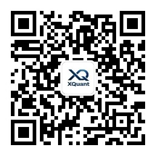

# XQuant Learning

《XQuant：人人都是量化交易员》课程配套的 Specs 与 Notebooks 开源仓库。

## 这是什么

本仓库包含课程中每个章节的：

- **Specs** — 任务说明书。学员通过撰写 spec 指挥 AI 完成所有编码工作，而非自己写代码。
- **Notebooks** — 可运行的 Jupyter Notebook 源代码，是每个 spec 的最终产出。

## 课程结构

课程围绕 9 个核心问题展开，从零构建一个可实盘运行的量化交易系统：

| 章节 | 问题 | 内容 |
|------|------|------|
| Q0 | 开始前的准备 | 环境搭建 |
| Q1 | 量化交易怎么赚钱？ | 建立直觉，跑通最小闭环 |
| Q2 | 买什么？ | 标的筛选，构建 Universe |
| Q3 | 买多少？ | 权重分配，仓位管理 |
| Q4 | 什么时候买卖？ | 信号生成，Agent 决策逻辑 |
| Q5 | 怎么知道策略有效？ | 回测验证，建立评估体系 |
| Q6 | 如何避免自欺欺人？ | 过拟合识别，稳健性检验 |
| Q7 | 如何真正执行？ | 实盘系统，从回测到交易 |
| Q8 | 如何持续改进？ | 策略迭代，建立方法论闭环 |
| Q9 | 量化交易的日常是什么？ | 因子研究，从想法到策略的日常工作流 |

## 目录结构

```
xquant-learning/
├── q0-before-you-start/
│   └── specs/
├── q1-how-to-profit/
│   ├── specs/          # 6 个 spec：获取数据 → 定投回测 → 基准对比 → 均线择时 → 参数扫描 → 过拟合
│   └── notebooks/      # 01-minimal-strategy.ipynb
├── q2-what-to-buy/
│   └── ...
└── ...
```

## 如何使用

1. 阅读某章节的 `specs/` 目录，了解每一步的任务目标
2. 将 spec 喂给 AI 编程工具（Claude Code / Cursor / ChatGPT 等），让 AI 帮你完成实现
3. 对照 `notebooks/` 中的参考实现，验证你的产出

## 课程特色

- **编程语言无关** — 全程用自然语言驱动 AI，学的是"如何描述问题"而非"如何写 Python"
- **问题驱动** — 不从理论开始，而从"这个策略能赚钱吗"开始
- **Agent 思维框架** — 把策略看作 Agent：Environment（标的池）→ State（市场状态）→ Action（买卖决策）

## 作者与服务

### 刑无刀

本文作者 @刑无刀。《机器学习：实用案例解析》译者，《推荐系统》
作者，极客时间《推荐系统 36 式》专栏作者，开源书《人人都是
量化交易员》作者，15 年 AI 从业经验，贝壳（纽交所 + 港交所
双重上市公司，股票代码 BEKE/2423）前技术总监。

- 公众号：刑无刀
- 小红书：刑无刀


### MatrixSpk

本文作者 @MatrixSpk，多年财务及投资经验，系北大 MBA，
公众号「i锐角」主理人。

- 公众号：i锐角


### XQuant-Shop

XQuant-Shop 是面向全球个人投资者的一站式量化投资决策平台，
简称 XQuant 平台。XQuant 平台集成标准化量化数据可视化看板、
零门槛策略搭建工具与自动化工作流体系，帮助普通投资者快速搭建
专属量化投资策略。

- 服务号：XQuant-Shop



## License

MIT
